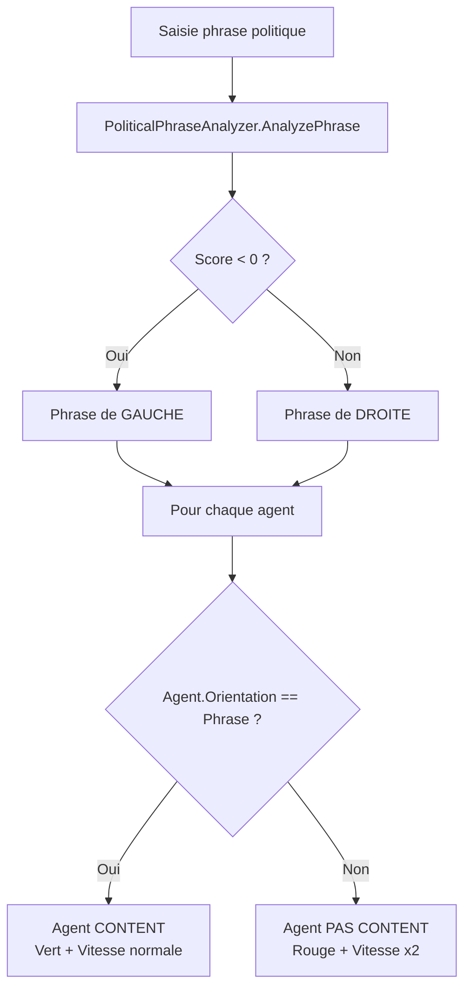

# 🗳️ VoxPopuli - Système d'Analyse Politique des Agents

## 📋 Vue d'ensemble

Le système permet d'analyser une phrase politique et de voir comment les agents réagissent en fonction de leur orientation politique (Gauche/Droite).

## 🎯 Fonctionnalités implémentées

### 1. **Orientation Politique des Agents**
- ✅ Chaque agent se voit assigner une orientation politique aléatoire au lancement :
  - **50% Gauche** (`PoliticalOrientation.Left`)
  - **50% Droite** (`PoliticalOrientation.Right`)

### 2. **Analyse de Phrases Politiques**
Le service `PoliticalPhraseAnalyzer` analyse les phrases avec des mots-clés :

**Mots-clés de GAUCHE :**
- taxer, redistribuer, égalité, social, public, solidarité, etc.

**Mots-clés de DROITE :**
- liberté, entreprise, marché, sécurité, tradition, etc.

**Exemples :**
```csharp
// Phrase de gauche
"Il faut taxer les richesses pour redistribuer les ressources"
→ Score négatif → Gauche

// Phrase de droite
"Il faut baisser les impôts pour libérer l'entreprise"
→ Score positif → Droite
```

### 3. **Réaction des Agents**

Quand une phrase est analysée :

| Orientation Agent | Phrase | Résultat | Couleur | Vitesse |
|------------------|--------|----------|---------|---------|
| Gauche | Gauche | ✅ Content | 🟢 Vert | 1.5 px/frame |
| Gauche | Droite | ❌ Pas content | 🔴 Rouge | 3.0 px/frame |
| Droite | Droite | ✅ Content | 🟢 Vert | 1.5 px/frame |
| Droite | Gauche | ❌ Pas content | 🔴 Rouge | 3.0 px/frame |

**⚡ Les agents rouges se déplacent 2x plus vite !**

## 🎮 Utilisation dans l'interface

### Option 1 : Saisie personnalisée
1. Dans le panneau "Contrôles", saisissez une phrase politique
2. Cliquez sur "▶ Analyser et Diffuser"
3. Observez les agents changer de couleur et de vitesse

### Option 2 : Exemples prédéfinis
- **Bouton "Diffuser Message A"** : Phrase de gauche
- **Bouton "Diffuser Message B"** : Phrase de droite

## 📁 Structure du code

### Nouveaux fichiers
```
VoxPopuli.Client/
├── Models/
│   ├── AgentModel.cs (modifié)
│   │   ├── + PoliticalOrientation (enum)
│   │   ├── + IsHappy (bool)
│   └── PoliticalOrientation (enum)
│
├── Services/
│   └── PoliticalPhraseAnalyzer.cs (nouveau)
│       ├── AnalyzePhrase(string) → float
│       └── IsAgentHappy(orientation, phrase) → bool
│
├── ViewModels/
│   └── SimulationViewModel.cs (modifié)
│       ├── + CurrentPoliticalPhrase (string)
│       ├── + AnalyzePoliticalPhrase(string)
│       └── + AnalyzePhraseCommand
│
└── Views/
    └── SimulationPage.xaml (modifié)
        └── + Entry pour saisie de phrase
```

### Constantes de vitesse
```csharp
private const float HappyAgentSpeed = 1.5f;    // Vert (content)
private const float UnhappyAgentSpeed = 3.0f;  // Rouge (pas content)
```

## 🔄 Flux d'exécution



## 📊 Logs de débogage

Le système affiche des logs dans la console :

```
📊 Population initialisée : 500 agents
   - Gauche: 248, Droite: 252
📢 Phrase politique analysée: 'Il faut taxer les richesses pour redistribuer les ressources'
   Score: -0.67 (Gauche)
   Résultat: 248 contents (verts), 252 pas contents (rouges)
```

## 🎨 Mise à jour visuelle

La légende a été mise à jour :
- 🟢 **Vert** = Content (opinion alignée)
- 🔴 **Rouge** = Pas content (opposition) - Vitesse x2

## 🔮 Évolutions possibles

1. **Ajouter une orientation Neutre**
2. **Intégrer le modèle ML.NET** pour une analyse plus fine
3. **Ajouter des nuances** (pas seulement binaire content/pas content)
4. **Historique des phrases** avec graphiques de réaction
5. **Clusters dynamiques** (regroupement par affinité)

## 📦 Placement du modèle ML.NET

Placez votre fichier `VoxPopuli.mlnet` dans :
```
VoxPopuli.Client/Resources/MLModels/VoxPopuli.mlnet
```

Le modèle sera automatiquement chargé au démarrage (mode DEMO si absent).
